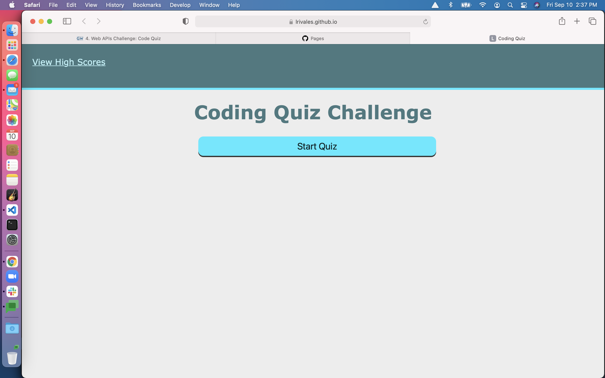
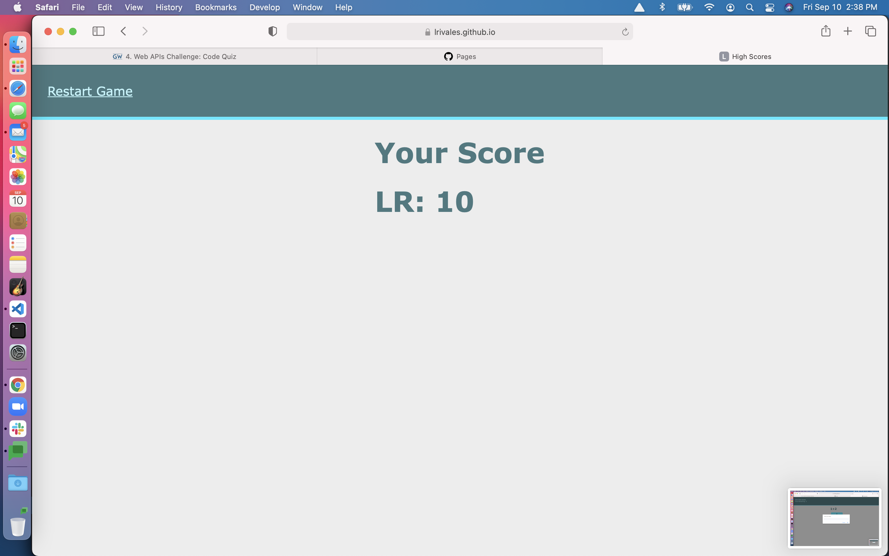

# Coding Quiz

Module 4 Challenge

This is the module 4 challenge for the GW Coding Bootcamp course submitted by Lawrence Rivales.

URL can be reached here: https://lrivales.github.io/coding-quiz/

Snapshots can be seen here:

